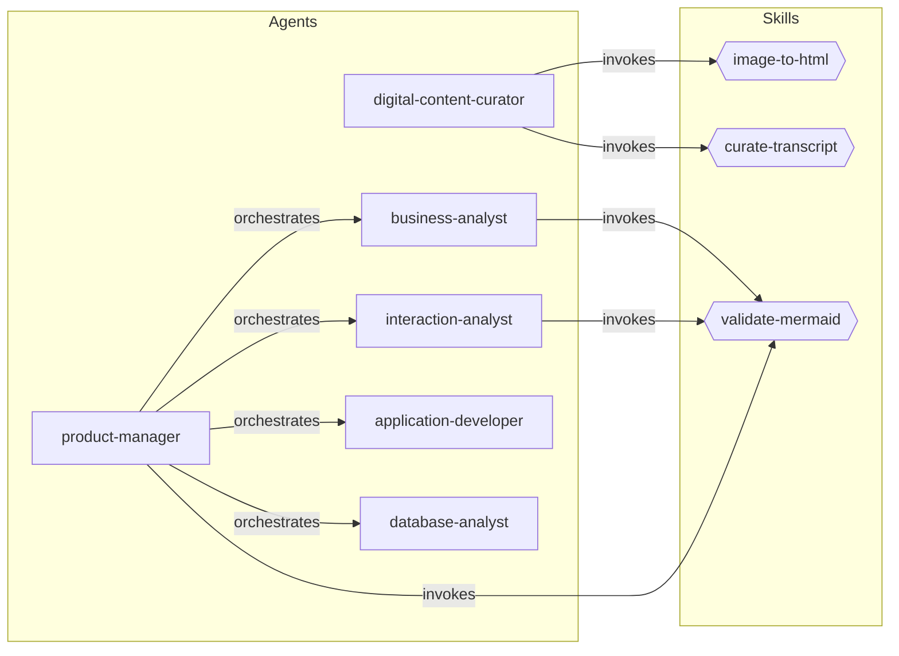
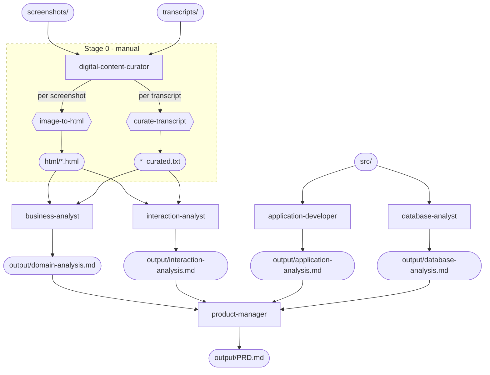

# Claude Legacy Reverse Engineering Plugin

A Claude Code plugin for Defra's Legacy Application Programme (LAP) to aid in the reverse engineering of legacy applications.

## Purpose

This plugin extends Claude Code with specialised tooling and prompts to assist engineers in understanding, documenting, and modernising legacy systems within Defra's estate.

## Prerequisites

- [Claude Code](https://docs.anthropic.com/en/docs/claude-code) installed and authenticated

## Local Development

The plugin is entirely file-based (Markdown and JSON) — there is no build step. Changes to skills, hooks, and configuration are picked up on the next session start.

### Running the plugin locally

```bash
claude --plugin-dir /path/to/claude-legacy-reveng-plugin
```

Or add a shell alias for convenience:

```bash
alias claude-lap='claude --plugin-dir /path/to/claude-legacy-reveng-plugin'
```

### Development workflow

1. Edit a skill, hook, or config file in your editor
2. Start a new Claude Code session with `--plugin-dir` pointing at your local clone
3. Verify the plugin loaded with `/skills` or `/mcp` inside the session
4. Test your changes (e.g. `/defra-legacy-reveng:skill-name`)
5. Iterate — exit the session, tweak files, relaunch

### Tips

- **Skills** are Markdown files — edit and relaunch, nothing to compile.
- **Hooks** run shell commands — test them standalone in your terminal before wiring them into `hooks/hooks.json`.
- **MCP servers**, if added later, are the only component that may require a build step.

## Project Structure

```
claude-legacy-reveng-plugin/
├── .claude-plugin/
│   └── plugin.json       # Plugin manifest
├── skills/               # Reverse engineering skills (slash commands)
├── hooks/
│   └── hooks.json        # Hook configuration
├── agents/               # Custom subagent definitions
├── CLAUDE.md             # Plugin-level context for Claude
└── README.md
```

## Input and Output

Place your raw material in the host project (the project you run the plugin from) using the directory layout below. The plugin's skills and agents expect these locations.

### Inputs (you provide)

| Directory | Contents |
|-----------|----------|
| `screenshots/` | UI screenshots of the legacy application (`.png`, `.jpg`, `.jpeg`, `.gif`, `.bmp`, `.webp`) |
| `transcripts/` | Stakeholder interview transcripts (`.txt`) |
| `src/` | Legacy application source code (`.sln`, `.vbproj`, `.csproj`, `.vb`, `.cs`, `.aspx`, `.ascx`, `.asmx`, `.cshtml`, `.Master`, `.resx`, `.config`, `.json`, `.sql`, `.sqlproj`, `.rpt`, `.rdl`, `.rdlc`) |

### Outputs (generated by the plugin)

| Path | Produced by | Description |
|------|------------|-------------|
| `html/*.html` | `image-to-html` | Semantic HTML mockup of each screenshot |
| `transcripts/*_curated.txt` | `curate-transcript` | Interview transcripts with off-topic content removed (intermediate) |
| `output/domain-analysis.md` | `business-analyst` | Comprehensive domain analysis (ubiquitous language, bounded contexts, subdomains, context map) extracted from curated transcripts and HTML mockups |
| `output/interaction-analysis.md` | `interaction-analyst` | Comprehensive interaction analysis (screen inventory, user workflows with mermaid diagrams, screen navigation map) stitched from HTML mockups and curated transcripts |
| `output/application-analysis.md` | `application-developer` | Comprehensive application analysis (workflows, behaviours, domain model, business rules, reports) extracted from source code |
| `output/database-analysis.md` | `database-analyst` | Comprehensive database analysis (schema, stored procedures, triggers, constraints, database-level business rules) extracted from SQL and source code |
| `output/PRD.md` | `product-manager` | Comprehensive Product Requirements Document synthesised from all analysis outputs |

### Output management

Generated outputs are regeneratable artefacts. Recommended version control approach:

**Commit to version control:**
- `output/PRD.md` — the final deliverable
- `output/domain-analysis.md`, `output/interaction-analysis.md`, `output/application-analysis.md`, `output/database-analysis.md` — the four analysis files

**Add to `.gitignore` (intermediate/regeneratable):**

```gitignore
# Plugin intermediate outputs
html/
transcripts/*_curated.txt
```

## Component Map

Rectangles are agents, hexagons are skills. Arrows show invocation relationships.



## Skills

| Skill | Description |
|-------|-------------|
| `image-to-html` | Converts a legacy UI screenshot into semantic, unstyled mockup HTML |
| `curate-transcript` | Removes off-topic content from interview transcripts |
| `validate-mermaid` | Validates all Mermaid diagram blocks in a markdown file and fixes broken diagrams in place |

## Agents

| Agent | Description |
|-------|-------------|
| `digital-content-curator` | Prepares raw screenshots and interview transcripts into structured, analysis-ready outputs (HTML mockups, curated transcripts) |
| `business-analyst` | Extracts strategic DDD patterns (ubiquitous language, bounded contexts, subdomains, context map) from curated transcripts and HTML mockups for PRD generation |
| `interaction-analyst` | Stitches HTML mockups with curated interview transcripts to produce comprehensive interaction analysis (screen inventory, user workflows, screen navigation map) for PRD generation |
| `application-developer` | Comprehensively reads legacy .NET source code under `src/` to extract workflows, behaviours, domain model, business rules, and reports for PRD generation |
| `database-analyst` | Comprehensively reads legacy SQL Server database code under `src/` to extract schema, stored procedures, triggers, constraints, and database-level business rules for PRD generation |
| `product-manager` | Synthesises all analysis outputs (domain, interaction, codebase, database) into a comprehensive Product Requirements Document for implementation planning. Requires curated content as a prerequisite |

## Pipeline

The pipeline runs in stages from raw inputs to a finished PRD. Stage 0 (content curation) is run manually before launching the `product-manager`, which orchestrates the remaining stages. In the diagram below, rectangles are agents, hexagons are skills, stadium shapes are files, and the dashed border marks the manual stage.



| Stage | Components | Runs in parallel with |
|-------|------------|-----------------------|
| 0 — Content preparation (manual) | `digital-content-curator` invokes `image-to-html` and `curate-transcript` | Run before launching `product-manager` |
| 1 — Code analysis | `application-developer` and `database-analyst` read `src/` independently | Stage 2 |
| 2 — Content analysis | `business-analyst` and `interaction-analyst` consume curator outputs | Stage 1; depends on Stage 0 |
| 3 — Synthesis | `product-manager` reads all four analyses and writes `output/PRD.md` | None; depends on Stages 1 and 2 |

## Troubleshooting

### Content curation stalls on large file sets

The `digital-content-curator` agent processes files sequentially within a single Claude session. When the number of screenshots or transcripts is large (e.g. 50+), the session may exhaust its turn budget before finishing all files.

If this happens, bypass the agent and invoke the skills directly from a bash loop. Each iteration runs its own Claude process with a fresh context window, so there is no turn budget limit:

```bash
#!/usr/bin/env bash
CLAUDE="claude --plugin-dir /path/to/claude-legacy-reveng-plugin --model claude-sonnet-4-20250514 --dangerously-skip-permissions"

# Process screenshots
for img in screenshots/*.{png,jpg,jpeg,gif,bmp,webp}; do
  [ -f "$img" ] || continue
  name="${img##*/}"
  name="${name%.*}"
  [ -f "html/${name}.html" ] && echo "Skipping $img (already done)" && continue
  echo "Processing $img..."
  $CLAUDE -p "/image-to-html $img" \
    --allowedTools "Read,Write,Bash(mkdir*)"
done

# Process transcripts
for txt in transcripts/*.txt; do
  [ -f "$txt" ] || continue
  [[ "$txt" == *_curated.txt ]] && continue
  name="${txt##*/}"
  name="${name%.txt}"
  [ -f "transcripts/${name}_curated.txt" ] && echo "Skipping $txt (already done)" && continue
  echo "Processing $txt..."
  $CLAUDE -p "/curate-transcript $txt" \
    --allowedTools "Read,Edit,Bash(mkdir*;cp*)"
done
```

The skip logic makes this resumable — re-run the script and it picks up where it left off.

## Status

Early development.
